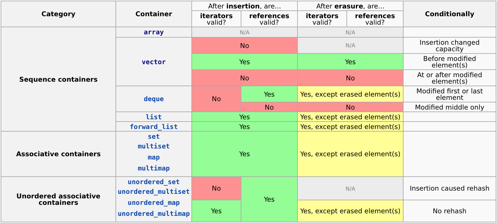

# VG101: Introduction to Computer and Programming
## Week13 Checklist
### C++ Dynamic Memory Allocation
- `new` and `delete`: dynamic memory allocation in C++
- example
```C++
// Allocate single integer
int *pInt = new int;
delete pInt;

// Allocate an integer array of length = 5
int size = 5;
int *pArr = new int[size];
delete[] pArr;   // note `[]` here
```
- when you `new` an array, you should delete it by `delete[]`. Using only `delete` here will result in **undefined behavior**
- Don't mix with `malloc` and `free` (again, don't mix using any C-style syntax and C++-style syntax)
- Advantage of `new` over `malloc`
    - `new` is an C++ keyword (no library requirement), `malloc` is a library function
    - `new` will call the constructor, `malloc` will not
    - `new` will return appropreiate pointer type
    - The intention behind `new` and `malloc` is different
      - `malloc` is simply requing a piece of memory, so the parameter it requires is the number of bytes requred
      - `new` is not simply requiring a piece of memory; it always do class construction, so it requires user to indicate the class

### Linked List

Linked list is another famous and commonly used data structure (after array). The basic idea of linked list is, there is a "node", and it contains some information and a pointer to the next node. As long as we keep the first node, we could traverse all the node.

```C++
class Node
{
    int value;				// You may add more property to a node
    Node* next;
    Node(int val) { this->value = val; next = nullptr; }
}

class LinkedList
{
    Node* first;
    LinkedList() { this->first = nullptr; }
    ~LinkedList() {
        Node* current = first;
        while (current)
        {
            Node* temp = current;
            current = current->next;
            delete temp;
        }
    }
    void push_back(int val)
    {
        if (!this->first)		// `first` is nullptr
        {
            first = new Node(val);
            return;
        }
        Node* current = first;
        while (current->next)
            current = current->next;
       	// Now we `current` is last node
        current->next = new Node(val);
    }
    Node* search(int val)		// search the node with the same value as `val`
    {
        Node* current = this->first;
        while (current)
        {
            if (current->value == val)
                return current;
            current = current->next;
        }
        return nullptr;
    }
    void remove(Node* node)
    {
        if (node == this->first)
        {
            this->first = node->next;
            delete node;
            return;
        }
        Node* current = this->first;
        while (current->next != node)
            current = current->next;
        current->next = node->next;
        delete node;
    }
}
```

There may also be other variation of linked list: doubly linked list, etc.

### Reference
#### Reference Variable
- A reference variable is an alias for another variable. Any changes made through the reference variable are actually performed on the original variable.
    - Must be initialized
    - Cannot change the variable the reference variable refers to
```C++
int a;
int &ra = a;    // any change to `ra` will affect the value of `a`
```

#### Reference Variable in Function
- A very useful techniuque to share variable during function calling

- Reference is somehow a syntax sugar in C++; it is essentially realized by pointer, but it makes code more clean and easy to read

- Convention tips: when we discussing "pass by reference", we may indicate both "pass by pointer" and "pass by reference"; the generalized concept "pass by reference" is as the other side of "pass by value"

- Reference should be binded when initialized

  ```C
  int x = 4;
  int& y = x;		// `y` is binded to `x` forever
  y = 5;			// assign 5 to `x`
  int z = 233;
  y = z;			// it is not binding `z` to `y`
  				// it is assigning the value of `z` to `y`
  ```

- Use reference variable as function parameter

- Similar to pointer
```C++
void swap(int &a, int &b)     // function parameters are reference variable
{                             // change of a, b will be kept
    int temp = a;             // similar to using pointer, but more clear
    a = b;
    b = temp;
}

int main()
{
    int a = 1, b = 2;
    swap(a, b);               // directly use variable instead of using address
    cout << "a = " << a << ", b = " << b << endl; // result: a = 2, b = 1
    return 0;
}
```

- Counterpart program using pointer 
```C++
void swap(int *a, int *b)     // function parameters are pointer
{
    int temp = *a;
    *a = *b;
    *b = temp;
}

int main()
{
    int a = 1, b = 2;
    swap(&a, &b);             // pass the address 
    cout << "a = " << a << ", b = " << b << endl; // result: a = 2, b = 1
    return 0;
}
```

- Another advantage of reference: a more elegant way to pass by reference rather than pass by value
    - In C++, function parameter need to be class object, usually big in size
    - Pass by value require copy the big class object, very inefficient
    - Pass by reference can instantly finish the passing
    - If we are sure that we will not change the vaiable inside the function, use `const` reference to avoid mistakenly modifying

### Constructor

- Constructor (ctor) is called automatically when you declare an instance (variable) of a class.
- Why we need a ctor?
  - When we view a class as an abstract (a black box) with invariant (some specific rules inside the box), we would expect the invariant is always valid from the time it is created
    - e.g. the `size` of class `DynamicSizeArray` should equal to the number of elements inside (initialized to zero); the `capacity` should be the side of allocated array so that we will not across the bound
  - Every time a public function returns, the invariant should be maintanced.
- Ctor should be `public` (only in some tricky case that it can be `private`)

- If the programmer doesn't write any constructors, compiler will automatically synthesize a default constructor for you (taking no argument, call all the ctors of its data members and do nothing else)

  - if you write one, the default one will not be synthesized

  - still suggest add `= default` after the default constructor if you indeed agree with the automatically synthesized ctor

    ```C++
    class DynamicSizeArray
    {
        int* array;
        int size, capacity;
    	DynamicSizeArray() = default;	// actually you shouldn't use default here
        								// all the `int` will be left as `uninitialized`
    }
    ```

- Copy constructor (and move constructor after c++11)

  - ```C++
    class DynamicSizeArray
    {
        ...
    	DynamicSizeArray(const DynamicSizeArray& other) = default;
        		// copy ctor should take const reference as the argument	
        		// default one will perform shallow copy
    }
    ```

  - will also be synthesized automatically, but performance shallow copy

  - Aside: shallow copy vs. deep copy; data ownship

    - If the class is holding ownship of some data by memory allocated pointer, simply copy the pointer will result in two instance both holding the address of some piece of memory. If one free the allocated memory, the other's pointer will become a dangling pointer
    - In such case, we introducing "deep copy." Deep copy not simply copy the value of pointer, but instead, it `new` another piece of memory to store the data, and copy the data one by one from the source instance

  - ```c++
    class DynamicSizeArray
    {
        ...
    	DynamicSizeArray(const DynamicSizeArray& other) // deep copy
        {
            this->size = other.size; 	// `this` is a pointer to the current instance
            this->capacity = other.capacity;
            delete[] array;
            array = new int[this->capacity];
            for (int i=0; i<size; i++)
                array[i] = other.array[i];
        }
    }
    ```

  - `operator=` is somehow also do similar thing as copy ctor (and move ctor)

  - ```c++
    class DynamicSizeArray
    {
        ...
    	DynamicSizeArray(const DynamicSizeArray& other) // deep copy
        {
            this->size = other.size; 	// `this` is a pointer to the current instance
            this->capacity = other.capacity;
            delete[] array;
            array = new int[this->capacity];
            for (int i=0; i<size; i++)
                array[i] = other.array[i];
        }
        DynamicSizeArray& operator=(const DynamicSizeArray& other) // deep copy
        {
            this->size = other.size; 	// `this` is a pointer to the current instance
            this->capacity = other.capacity;
            delete[] array;
            array = new int[this->capacity];
            for (int i=0; i<size; i++)
                array[i] = other.array[i];
            return *this;
        }
    }
    ```

### Destructor

- Destructor (dtor) is called automatically when the object goes out of scope.

- Dtor is used to do some operations when a class instance's life cycle end and its memory is reclaimed by operating system

- Similar to ctor, dtor will also be synthesized if the programmer doesn't write one

- Dtor must be `public`

- A common usage is to free the memory allocated

- ```c++
  class DynamicSizeArray
  {
      ~DynamicSizeArray { delete[] array; } 
      			// everytime a DSA gone
      			// it will free the memory it allocated
      			// so there will never be any memory leak
  }
  ```
- Syntax similar to constructor 

- ```C++
  public:
    MyClass();        // constructor of MyClass
    ~MyClass();       // destructor of MyClass
  ```

### More on `stream`

- `stream` is a commonly used concept in C++ with some special property (e.g. `iostream`, `fstream`, `stringstream`). You may view `stream` as a pipe, and we could fill it with some content from one end, and retrieve the content from the other end of the pipe
  - `iostream` is taking the keyboard (or other input device) as the one end of pipe
  - `fstream` is taking the file as one end of pipe
- All the `stream` will have operators `>>` and `<<`
- When using `>>`, it will stop everytime it meets white space (blank, `\t`, `\n`), so the most efficient way in C++ to separate words is to use `stringstream`

```C++
#include <iostream>
#include <string>
#include <sstream>	// library required for stringstream
int main()
{
    string word1, word2, word3;
    string line;
    // input: "VG101 hello world"
    getline(cin, line) // now `line`: "VG101      hello world\n"
    stringstream ss(line) // ctor of stringstream: take a string as the parameter
    line >> word1 >> word2 >> word3;
    	// word1: "VG101"
    	// word2: "hello"
    	// word3: "world"
}
```

### Default Argument

- A default argument is a value given in the declaration that the compiler automatically inserts if you don’t provide a value in the function call.
- If function has several argument and some are default, default arguments are always put at the end
```C++
int add(int a, int b = 1) // a is not default arguemnt, but b is
{                         // b should be put behind a
    return a+b;           // valid call: add(1), add(1, 3)
}
```

### STL (Standard Template Library)
#### Template
- We want a class to support different variable types (int, char ... even class object)
- We can use template
- For example: a list of any variable type
```C++
MyList <T>                // <T> is called template  
{                         // You can regard it as place holder for variable type
public:
    T * list;
};

MyList<int> intList;        // Using the class, we specity the variable type
MyList<string> stringList;  // It can even be class object
```

#### STL container classes 



- Big picture of STL:
  - Sequential Containers
    - `vector`
    - `deque`
    - `list`
    - ...
  - Associative Containers
    - `map`
    - `unordered_map`
    - `set`
    - `unordered_set`
    - ...
  - Container Adapters
    - Sequential Container Adapters
      - `stack`
      - `queue`
      - `priority_queue`
    - ...

- STL container classes that this course mainly focuses on
    - `string`
    - `vector`
- After C++11 STL implementation becomes very efficient due to the introducing of right value reference
- Use STL properly will helps a lot. 

#### vector

- `#include <vector>`
- Some member function
  - Constructor
    - Default: no argument, no element inside, empty
    - Copy ctor (copy from another vector with same template)
  - `empty`: return `true` if the vector is empty
  - `size`: return the number of element inside the vector
  - `push_back`: add another element to the end of the vector
  - `pop_back`: remove the last element

```C++
std::vector<int> v1;		// indicate the template
std::vector<std::string> vs;
v1.push_back(4);
std::vector<int> v2(v1);	// copy element from v1
```

- Traversal

  - Iterator
    - iterator is somehow a simulation of pointer for STL container
    - use `*` to "dereference" an iterator (overloaded); `++` and `--` also be overloaded for iterator
    - member functions `begin`, `end`: return iterator of the first and "the past of the last" element
      - don't `*v.end()`
    - Note: iterator can be invalided by some operation (e.g. `push_back` of vector: if it invovles reallocatation, the previous iterator will be invalided). Always be careful for iterator invalidation (read document first to see whether a function may result in iterator invalided!)
  - Index
    - `vector` also overload `operator[]`, so you could access it as an array
    - member function `at`: similar as `operator[]`, but perform cross the boundary check
  - Why we need iterator if we could traversal by index?
    - Not all the container support index; but almost all the container provides support on iterator
    - Iterator may not allow random access (some container cannot operload `+` or `-` for its iterator, e.g. `std::list`)

```c++
std::vector<int> v1;
v1.push_back(1);
v1.push_back(2);
v1.push_back(3);
v1.push_back(4);
v1.push_back(5);
for (std::vector<int>::iterator it=v1.begin(); it!=v1.end(); it++)
// or you may use `auto` after c++11: `for (auto it=v1.begin(); it!=v1.end(); it++)`
// `auto` will set the type of variable by the return type of function
{
    std::cout << *it << std::endl;
}

for (int i=0; i<v1.size(); i++)
{
    std::cout << v1[i] << std::endl;
    // or: std::cout << v1.at(i) << std::endl;
}
```

- Reference for further reading: https://en.cppreference.com/w/cpp/container/vector

#### string

- `#include <string>`

- `std::string` is actually a templated (with char) of `std::basic_string`

  - `typedef std::basic_string<char> std::string`

- Some member function

  - Constructor
    - default: no argument, no element inside, empty

    - copy ctor

    - taking a `const char*` as the argument

    - ```c++
      std::string str1("hello world");
      char char_array[] = "aloha";
      std::string str2(char_array);
      ```

  - `empty`, `push_back`, `pop_back`

  - `size` vs. `length`

  - `append`

  - `c_str`: returns a const pointer to a null-terminated character array with data equivalent to those stored in the string.

  - `operator==`: compare two string

  - `operator+`: concatenate two string

  - `operator[]`: access string as a char array

  - iterator

- Non-member function

  - `stoi`: non-member function convert string to number
  - `getline`: taking a `istream` and a `string` as argument, read a line from `istream` and store into `string`

- Reference for further reading: https://en.cppreference.com/w/cpp/string/basic_string

### Beyond VG101

Where to go after VG101:

- VE280 (Sophomore Summer): C++, some data structure
- VE281 (Junior Fall): Data structure
- VE370 (Junior Fall): Computer Organization
- VE477 (Fall): Algorithm
- VE482 (Fall): Operating System
- VE475 (Summer): Cryptography
- VE489 (Summer): Computer Networks