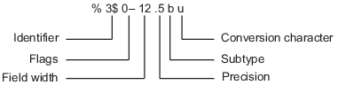

# VG101: Introduction to Computer and Programming
## Week5 Checklist
### Tips for HW/Lab
- Indent your code and name your variables properly! It can save you from shot by your future colleague.
- **Test your code!** Don't leave it there after finishing coding and hope it works.
- Do follow function prototype (just copy it from PDF)!
- When accessing elements in a matrix, make sure the index is valid.
```matlab
b = [];
b(1:3) = [3,4,5]; % it actually works, but don't use it
```

### What should I do when my code doesn't work?
- Pray. The God will help me to make it work.
- Stare at the code. It will fear me and fix itself.
- Send an email to TA saying that "Oh TA, my code doesn't work."
- Look through the code with naked eyes to find what is wrong.
- Rubber Duck Debugging.
- Use debugger (breakpoint).

### Monte Carlo Method & Random Number
- Monte Carlo Method
- Random number
(Pseudorandom)

```matlab
rand('state',0); % set random seed
rand(3)
% Result:
%   [0.9501    0.4860    0.4565
%    0.2311    0.8913    0.0185
%    0.6068    0.7621    0.8214]
```

- Generate random number: `rand()`,`randn()`,`randi()`
- Set random state as current time: `rand('state', datenum(clock))`
- Scaling random number: how to use `rand()` to generate random integer?

```matlab
% Generate random integer in [0, 100]
x = floor(rand() * 101) % why 101?
```

### String
- string is a 1-D matrix of chars
- `strcmp(s1, s2)`: compare two strings
- `strncmp(s1, s2, n)`: compare first n characters
- `strcmpi, strncmpi`: compare ignoring case
- `isletter('A') == 1`: true for letters
- `isspace(' ') == 1`: true for space
```matlab
isspace('  Find spa ces ')
% ans = [1 1 0 0 0 0 1 0 0 0 1 0 0 0 1]
```
- `strrep('This is a good example', 'good', 'great')`
- `strfind('This is a good example', 'good') == 11`: the starting indices of substring
- `num2str`, `str2num`, `str2double`

### File I/O
- what is file?
- `fid` (file descriptor)
- `fid = fopen(filename, permission)`
	- where the file will be read/written
	- permission:

| Permission | Explanation |
| :----------: | ------------- |
| 'r' | Open file for reading. |
| 'w' | Open or create new file for writing. Discard existing contents, if any. |
| 'a' | Open or create new file for writing. Append data to the end of the file. |
| 'r+' | Open file for reading and writing. |
| 'w+' | Open or create new file for reading and writing. Discard existing contents, if any. |
| 'a+' | Open or create new file for reading and writing. Append data to the end of the file. |

- `fclose(fid)`
- `fprintf(fid, format, A, ...)`
	- `stdout`, `stderr`
	- `fprintf(1, 'hello\n')`
	- `fprintf(2, 'hello\n')`
	- Formatting Operator: A formatting operator starts with a percent sign, %, and ends with a conversion character. The conversion character is required. Optionally, you can specify identifier, flags, field width, precision, and subtype operators between % and the conversion character. (Spaces are invalid between operators and are shown here only for readability).

	

	- Identifier, Flags, Subtype (skip)
	- Field Width: Minimum number of characters to print. The field width operator can be a number, or an asterisk (\*) to refer to an input argument.
	- Precision: 
		- For `%f`, `%e`, or `%E` : Number of digits to the right of the decimal point. Example: `'%.4f'` prints pi as `'3.1416'`
		- For `%g` or `%G` : Number of significant digits. Example: `'%.4g'` prints `pi` as `'3.142'`
	- Conversion Character

| Conversion | Details |
| :--------: | ------- |
| %d or %i | Base 10 |
| %u | Base 10 |
| %o | Base 8 (octal) |
| %x | Base 16 (hexadecimal), lowercase letters a–f |
| %X | Same as %x, uppercase letters A–F |
| %f | Fixed-point notation (Use a precision operator to specify the number of digits after the decimal point.) |
| %e | Exponential notation, such as 3.141593e+00 (Use a precision operator to specify the number of digits after the decimal point.) |
| %E | Same as %e, but uppercase, such as 3.141593E+00 (Use a precision operator to specify the number of digits after the decimal point.) |
| %g | The more compact of %e or %f, with no trailing zeros (Use a precision operator to specify the number of significant digits.) |
| %G | The more compact of %E or %f, with no trailing zeros (Use a precision operator to specify the number of significant digits.) |
| %c | Single character |
| %s | Character vector or string array. The type of the output text is the same as the type of `format`.|

Reference: https://www.mathworks.com/help/releases/R2018a/matlab/ref/fprintf.html

- `[A count] = fscanf(fid, format, sizeA)`
- `[A count] = fscanf(fid, format)`
	- Reads data from an open text file into *column vector* `A` (with dimensions `sizeA`) and interprets values in the file according to the format specified by `format`. The `fscanf` function reapplies the format throughout the entire file and positions the file pointer at the end-of-file marker (or `sizeA` is reached).
	- If `fscanf` cannot match `format` to the data, it reads only the portion that matches and stops processing.

Numeric Field：

| Conversion Specifier | Details |
| :------------------: | ------- |
| %d | Base 10 |
| %i | (Too complicated. Please refer to the document page) |
| %ld or %li | 64-bit values, base 10, 8, or 16 |
| %u | Base 10 |
| %o | Base 8 (octal) |
| %x | Base 16 (hexadecimal) |
| %lu, %lo, %lx | 64-bit values, base 10, 8, or 16 |
| %f, %e, %g | Floating-point fields can contain any of the following (not case sensitive): Inf, -Inf, NaN, or -NaN. |

Character Fields:

| Conversion Specifier | Details |
| :------------------: | ------- |
| %s | Read all characters *excluding white spaces*. |
| %c | Read any single character, including white space. To read multiple characters at a time, specify field width. |

Reference: https://www.mathworks.com/help/releases/R2018a/matlab/ref/fscanf.html

```matlab
x = 1:1:5;
y = [x;rand(1,5)];
fileID = fopen('nums2.txt','w');
fprintf(fileID,'%d %4.4f\n',y);
fclose(fileID);
% 1 0.8147
% 2 0.9058
% 3 0.1270
% 4 0.9134
% 5 0.6324

fileID = fopen('nums2.txt','r');
formatSpec = '%d %f';
sizeA = [2 Inf];
A = fscanf(fileID,formatSpec,sizeA)
%A = 2×5
%
%    1.0000    2.0000    3.0000    4.0000    5.0000
%    0.8147    0.9058    0.1270    0.9134    0.6324
fclose(fileID);
```

- Difference between *Text File* and *Binary File*.
- `[count, errmsg] = fwrite(fid ,A, precision)`
- `A = fread(fid, count, precision)`
	- Notice that, these two are for binary file.
	- Read with the same format that you write
	- If another format wanted, read in the format as written and then do transfer

```matlab
fid = fopen('alphabet.txt', 'r');
c = fread(fid, 5)
fclose(fid);
% c = [65; 66; 67; 68; 69]

fid = fopen('alphabet.txt', 'r');
d = fread(fid, 5, 'uint8=>char')'
fclose(fid);
% d = 'ABCDE'
```
- `status = fseek(fid,offset,origin)`
- `position = ftell(fid)`

```matlab
A = 1:5; 
fid = fopen('five.bin','w'); 
fwrite(fid, A,'short'); 
status = fclose(fid);

% Read the third number:
fid = fopen('five.bin','r'); 
fseek(fid, 4,'bof'); % why 4?
a = fread(fid,1,'short'); % a == 3
% Instead:
% fseek(fid, 3,'bof');
% a = fread(fid, 1,'short');
% a == 768. Why?

ftell(fid) % ans == 6

% read the second number
fseek(fid,-4,'cof'); % why -4?
a = fread(fid,1,'short');

fclose(fid);
```

- `fgetl(fid)`: read lines
- `feof(fid)`: true if reach end-of-file

```matlab
% In fgetl_demo.m:
fid = fopen('fgetl_demo.m', 'r');
n = 0;
while feof(fid) == 0
	tline = fgetl(fid);
	n = n+1;
	disp(sprintf('%d:%s',n,tline));
end
fclose(fid);
% 1:clc
% 2:clear
% 3:fid = fopen('fgetl_demo.m', 'r');
% 4:n = 0;
% 5:while feof(fid) == 0
% 6:tline = fgetl(fid);
% 7:n = n+1;
% 8:fprintf('%d:%s\n',n,tline);
% 9:end
% 10:fclose(fid);
```

### Newline
- Windows: `\r\n`
- Mac OS X, Linux: `\n`
- When in MATLAB, it will be decided by MATLAB setting, so `\n` should be fine

### Use file I/O and string manipulation to extract information from a file
- If the format known, read as format
- If length known, use matrix manipulation to slice
- Use space to separate words
- Be careful with `\n` (stored or discarded by the reading function)
- Sometimes, read the content and manipute in a matrix can be easier than manipute in file

### Plot Functions
- Special window: `figure`
- `plot()`

```matlab
% Plot y = sin(x) function
x = 0: 0.01: 10;
y = sin(x);
plot(x, y, 'ro');
title('y=sin(x)');
xlabel('x');
ylabel('y');
```

- LineSpec (See lecture 6 pages 35)
- Multiple lines in one graph: `hold on`
- Plot multiple graphs: `subplot`
- 3D plot: `plot3`, `meshgrid`, `contour`,`mesh`, `surf`
- Almost all of these can be done by mouse

```matlab
% 3D plot
[x,y]=meshgrid(-4:0.1:4);
z=(x.^2-y.^2).*exp(-(x.^2+y.^2));
contour(x,y,z);
mesh(x,y,z);
surf(x,y,z);
```

### Images
- Read as array (**uint8**)
- RGB channels
- Load image: `img = imread(filename)`
- Show image: `imshow(C)`, `image(C)`
- Write to image file `imwrite(C, filename)`
- Colormap: used to color black-white images, used in plot

### More on Matrix Manipulations
- `linspace`
```matlab
linspace(0, 20, 6) % a list within [0 20], 6 elements in total
% C = [0 4 8 12 16 20]
```
- `length`, `size`
- `max`, `min`
- `sum`, `mean`, `std`, `var`
- `round`, `ceil`, `floor`, `fix`
- `find`
```matlab
a = rand(1,5);
find(a == max(a));
```

### Exercise (Prepare for Your Midterm Exam)
- Write a script finding all prime numbers below 1000.
- Given text file as below:
```
Date  Price
Oct19 21.5
Oct20 21.9
Oct21 23.5
Oct22 23.0
Oct23 24.4
Oct24 23.5
Oct25 23.3
Oct26 22.8
Oct27 23.3
Oct28 24.5
Oct29 23.4
```
Read the file above, and calculate mean, variance, highest price, lowest price and outputs to `Analysis.txt` as format: 
```
The mean of prices is xxx.
The variance of prices is xxx.
xxx(Date) has highest price: xxx.
xxx(Date) has lowest price: xxx.
```

- A drunk person walks in a square. He starts at (0,0). Each second he randomly choose a direction and move forward one unit distance. Simulate his behavior in 100 seconds and use `plot` to show his trajectory.
- Another drunk person walks on a path (1D). He starts at x=0. Each second he randomly choose go positive direction or negative direction. Plot the probability distribution of his position after 100 seconds.

- Generate an 256\*256 image as below
  