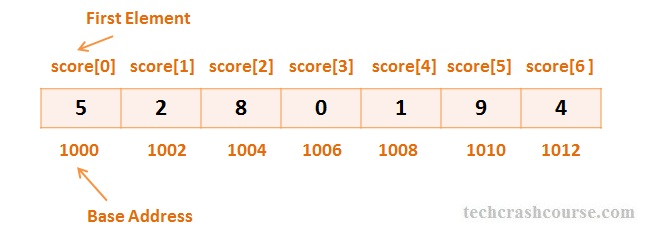
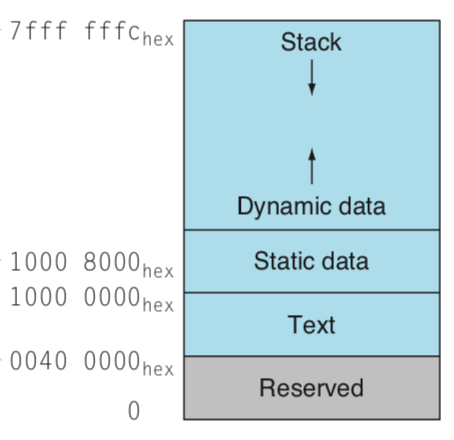

# VG101: Introduction to Computer and Programming
## Week8 Checklist

### Memory
- Computer organization: CPU and memory
- Basic memory model
- Address



- Aside: Complete memory model



### Arrays
- Similar to matrix in MATLAB.
- An **ordered** collection of data values of **the same type**.

#### Declaration
- Declare an array: type, name, size.
```C
// Type Name[Size]
int score[5];
char str[30];
double num[20];
```
- Why size is a constant number? Why can't we use a variable?
- Array in memory space. (different type require different size of memory.)
- Ways of initialization
```C
int zeros[20] = {0}; // All elements initialized as 0
int numbers[5] = {1, 2, 3, 4, 5};
int numbers[] = {1, 2, 3, 4, 5}; // Equivalent to previous
char str[4] = {'a', 'b', 'c', '\0'};
int numbers[5];
for (int i=0; i<5; i++)
	numbers[i] = i+1;	// The most common way of initialization
```
- Wrong ways of initialization
```C
int numbers[5] = {1, 2, 3, 4, 5, 6};// Wrong
int numbers[5];
numbers[5] = {1, 2, 3, 4, 5};	// Wrong
numbers = {1, 2, 3, 4, 5};		// Also wrong
```

#### Element accessing
- Index starts with 0.
- Use square bracket.
- Can use integer variable/expression to as array index
```C
int numbers[5];
for (int i=0; i<5; i++)
	numbers[i] = i;		// Note: this is the most common way of initialize
```
- Be careful: array out of bounds.
```C
int numbers[5];
for (int i=0; i<5; i++)
	numbers[i] = i;
for (int i=0; i<6; i++)
	printf("%d ", number[i]);	// Will not generate error! C will not check this.
								// Will print out data in your memory. 
								// Or even worse, revise data in your memory.
								// Will cause bugs very hard to find. 
```
- How could we visit data outside array? Access through address.
- Why index start with 0? Easy address computation.
- Question: what will the following code print?
```C
int numbers[5];
printf("%d\n", numbers);
// printf("%p\n", numbers);
```

#### Array in function
- Pass array as an argument
- Array pass by address
- Array in function declaration
```C
void ClearIntegerArray(int array[], int length)	// In declaration, use array[]
{												// Size need to be passed seperately
	for (int i=0; i<length; i++)
		array[i] = 0;
	return;
}

void PrintIntegerArray(int array[], int length)
{
	for (int i=0; i<length; i++)
		printf("%d ", array[i]);
	printf("\n");
	return;
}

int main()
{
	int array[5] = {1, 2, 3, 4, 5};
	PrintIntegerArray(array, 5);// When passing array as argument, no [] needed.
	ClearIntegerArray(array, 5);// Array name itself is address, address will be passed
	PrintIntegerArray(array, 5);// Pass by address => same array shared!
	return 0;
}
```
- Discussion: pass by address vs. pass by value
- Why function has only one return value? What to do if we want more information sending back?

#### Two-dimensional array
- An array whose elements are arrays.
- Use `A[i][j]` to access elements.
- Row first, column second.
- Stored as one dimensional array in memory.
- Address issue is more complicated.
- Higher-dimensioanl array has same property.

#### String
- An character array end with `'\0'`


